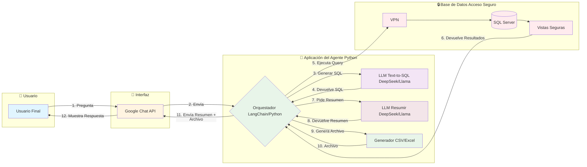

# ¡Hola! Soy Roger 👋

### Full-Stack Developer | Especialista en IA & RAG (Retrieval-Augmented Generation)

 

Soy un programador y estudiante de Informática en la UNAM, apasionado por construir soluciones que viven en la intersección del desarrollo web y la Inteligencia Artificial. Mi objetivo es transformar datos complejos en conocimiento accesible y crear aplicaciones inteligentes que aporten un valor real.

---

### 🔭 Mi Proyecto Destacado

#### **Agente Inteligente Text-to-SQL para Análisis Financiero**

Este es el proyecto más representativo de mis habilidades actuales, donde diseñé un sistema que permite a usuarios no técnicos consultar bases de datos complejas usando lenguaje natural.

*   **Problema:** Dar acceso controlado a analistas para consultar datos de regulación financiera en SQL Server, sin exponer información sensible y sin requerir que escribieran SQL.
*   **Solución:** Un agente que traduce preguntas en español a consultas SQL seguras, las ejecuta, y devuelve un resumen junto con un archivo Excel/CSV.
*   **Impacto:** Se democratizó el acceso a los datos, reduciendo el tiempo de consulta de horas a segundos y manteniendo siempre la seguridad de la información.

**Arquitectura de la Solución:**

---

### 🛠️ Mi Stack Tecnológico

<table>
  <tr>
    <td valign="top" width="50%">
      <strong>Frontend</strong> 
      
      
      
      
      
      
    </td>
    <td valign="top" width="50%">
      <strong>Backend</strong> 
      
      
      
      
      
    </td>
  </tr>
  <tr>
    <td valign="top" width="50%">
      <strong>IA & Bases de Datos</strong> 
      
      
      
      
      
    </td>
    <td valign="top" width="50%">
      <strong>DevOps & Herramientas</strong> 
      
      
      
      
    </td>
  </tr>
</table>

---

### 🌱 Otros Proyectos Relevantes

- **Autonomeals.net (EdTech):** Plataforma de aprendizaje de cocina para niños con un backend en Node.js/TypeScript y frontend en Vue.js. Incluye un agente RAG para mejorar la accesibilidad.
- **Sistema de Recomendación de Alimentos:** Modelo de aprendizaje automático que utiliza técnicas RAG para recomendar recetas basadas en datos nutricionales.
- **Análisis de Sentimientos de Estudiantes:** Creación de un pipeline de datos para evaluar el rendimiento académico mediante reconocimiento facial con DeepFace, MediaPipe y OpenCV.

---

### 📫 Cómo Contactarme

  
  

---

### 📊 Mis Estadísticas de GitHub

  
   
  

